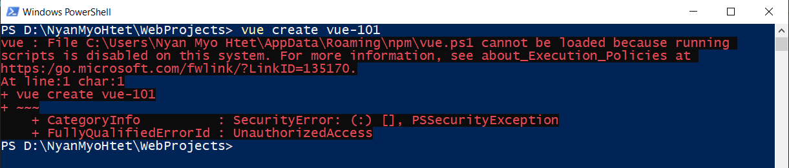
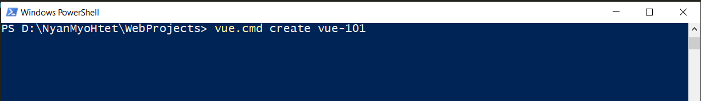
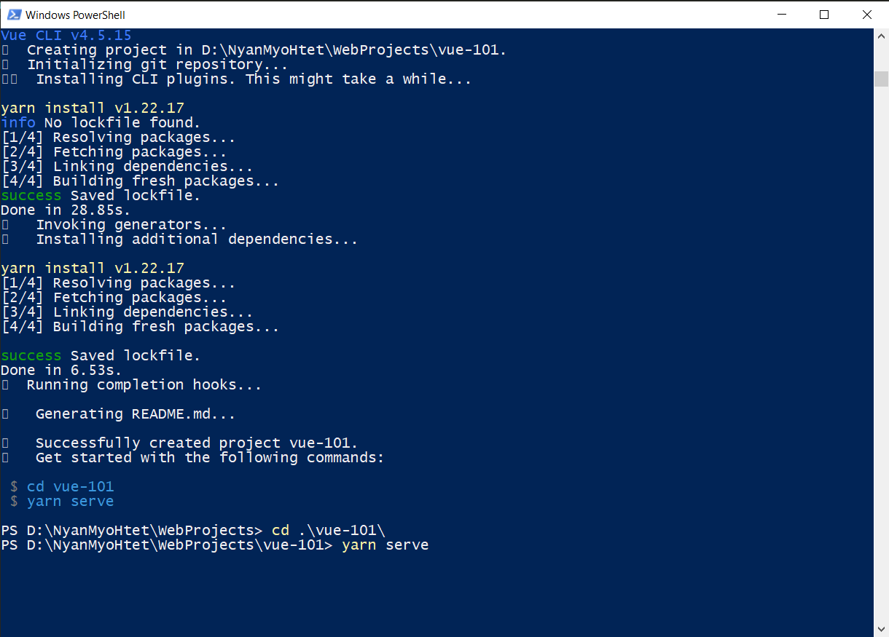
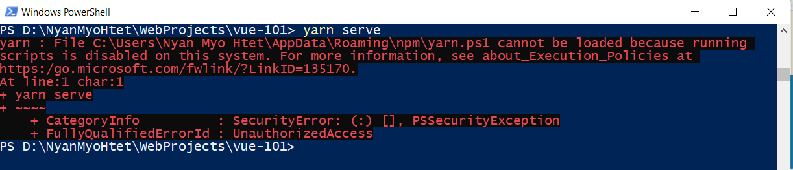
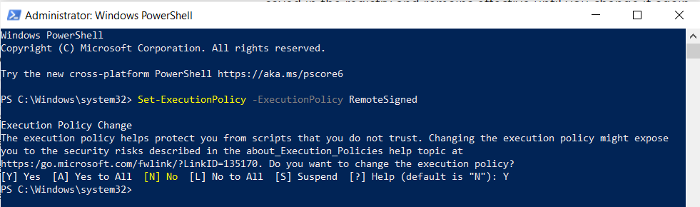
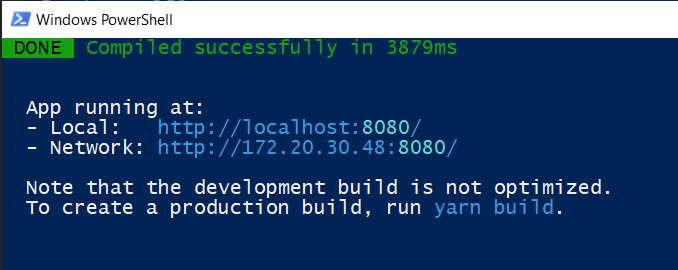

# Vue CLI

https://cli.vuejs.org

## Installation

Run the following command in PowerShell to install VueCLI:

```
npm install -g @vue/cli
```

## Install yarn

Install yarn by running `npm install --global yarn`

## Create a new Vue project:

```
vue create my-project
```

<div style="page-break-after: always;"></div>

## If following error occurs.



Solution: run as follow.



<div style="page-break-after: always;"></div>

## Change to new project directory(`cd <dir>`) and run `yarn serve`



<div style="page-break-after: always;"></div>

## If following eror occurs.



Solve by setting Execution Policies in PowerShell (Need to run PowerShell as **Administrator**):



<div style="page-break-after: always;"></div>

Newly created Vue App is running at http://localhost:8080.



