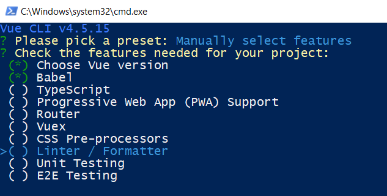
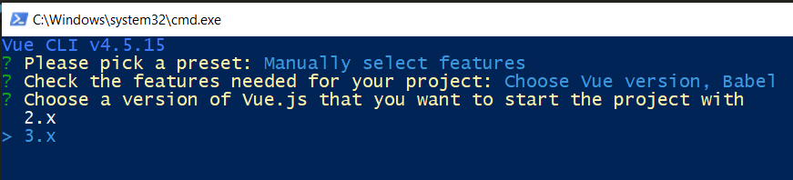
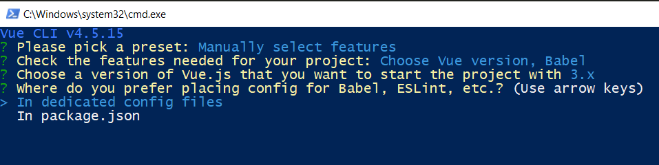
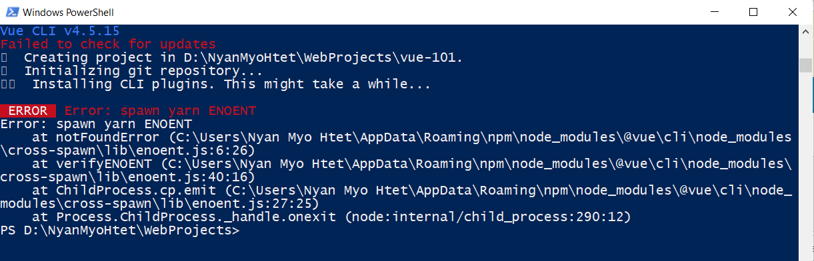

## Vue CLI

https://cli.vuejs.org

### Installation

Run the following command in PowerShell to install VueCLI:

```
npm install -g @vue/cli
```


Create a Vue project:

```
vue create my-project
# OR
vue ui
```

Error:


Solution:


Select a preset:


manually-select-features:



choose-vue-version:



placing-config:



yarn-need-to-install-error:




Install yarn by running `npm install --global yarn`

finish-vue-create-and-yarn-serve:


yarn.ps1-cannot-loaded:


powershell-set-execution-policies (Open PowerShell as Administrator):


vue-app-is-running at http://localhost:8080:


